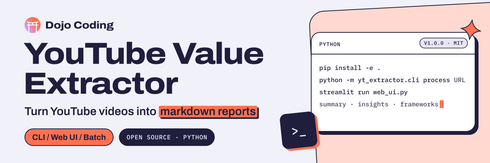

<p align="center">
  <a href="https://dojocoding.io">
    <picture>
      <source media="(prefers-color-scheme: dark)" srcset="docs/assets/banner-dark.svg">
      <source media="(prefers-color-scheme: light)" srcset="docs/assets/banner-light.svg">
      
    </picture>
  </a>
</p>

# YouTube Value Extractor

**A Python CLI and web UI that turn YouTube videos into structured markdown reports, for builders who learn from video.**

A powerful tool for extracting actionable insights from YouTube videos. Transform video content into comprehensive, structured markdown reports with detailed insights, actionable frameworks, and key moments - designed to maximize value and understanding from any video content.

[](LICENSE) [](CHANGELOG.md) [](https://www.python.org)

[Get started](#quick-start) · [CLI commands](#cli-commands) · [Docs](#documentation) · [Contribute](#contributing) · [Report an issue](https://github.com/DojoCodingLabs/youtube-extractor-tool/issues/new)

## Features

- **🧠 Full-Context Analysis**: Processes entire video transcripts at once for comprehensive understanding and insights
- **📝 Structured Insights**: Generates detailed paragraphs (not bullet points) with context, examples, and actionable details
- **🎯 Executive Summaries**: 2-3 paragraph summaries capturing core messages and value propositions
- **⚙️ Step-by-Step Frameworks**: Detailed, actionable methodologies with clear implementation steps
- **🚀 Multiple LLM Support**: Works with OpenAI (GPT-5, GPT-4o), Anthropic, or local models via Ollama
- **🌟 GPT-5 Enhanced**: Optimized for GPT-5 with unlimited token processing and JSON error recovery
- **🖥️ Web Interface**: User-friendly Streamlit UI with real-time progress and category organization
- **⚡ Intelligent Caching**: Caches transcripts and LLM responses for faster processing
- **🔄 Whisper Fallback**: Local transcription when YouTube transcripts aren't available
- **🛠 Rich CLI**: Full-featured command-line interface with progress indicators
- **📊 Batch Processing**: Process multiple videos efficiently

## Quick Start

**New to the tool?** See [QUICKSTART.md](QUICKSTART.md) for a 5-minute setup guide.

### Installation

```bash
# Clone the repository
git clone https://github.com/yourusername/youtube-extractor-tool.git
cd youtube-extractor-tool

# Option 1: Install with pip (recommended)
pip install -e .

# Option 2: Install with optional Whisper support
pip install -e ".[whisper]"

# Option 3: Install with development dependencies
pip install -e ".[dev,whisper]"

# Option 4: Install from requirements.txt
pip install -r requirements.txt
```

### Configuration

1. Copy the example environment file:
```bash
cp .env.example .env
```

2. Edit `.env` and set your API key:
```bash
# For OpenAI (GPT-5 provides highest quality analysis)
LLM_MODEL=gpt-5
# LLM_MODEL=gpt-4o-mini  # Faster/cheaper alternative
OPENAI_API_KEY=sk-your-openai-key-here

# For Anthropic Claude
# LLM_MODEL=claude-3-5-sonnet-latest
# ANTHROPIC_API_KEY=sk-ant-api-your-key-here

# For local models (Privacy-focused)
# LLM_MODEL=ollama/llama3.1:8b

# Set output directory (files organized by category)
DEFAULT_OUTPUT_DIR=./outputs
```

### Basic Usage

```bash
# Process a single video with category (saves to ./outputs/AI/Agents/)
python -m yt_extractor.cli process "https://www.youtube.com/watch?v=VIDEO_ID" --output-dir ./outputs --category "AI/Agents"

# Start the web UI (user-friendly interface)
source venv/bin/activate && streamlit run web_ui.py

# Process multiple videos
python -m yt_extractor.cli process "https://www.youtube.com/watch?v=ID1" "https://www.youtube.com/watch?v=ID2"

# Process from file (one URL per line)
echo "https://www.youtube.com/watch?v=ID1" > videos.txt
python -m yt_extractor.cli batch videos.txt

# Check configuration
python -m yt_extractor.cli config check

# View video info without processing
python -m yt_extractor.cli info "https://www.youtube.com/watch?v=VIDEO_ID"
```

## CLI Commands

### Main Commands

- `process [URLs...]` - Process one or more YouTube videos
- `batch FILE` - Process multiple videos from a file
- `info URL` - Show video information without processing

### Configuration Commands

- `config check` - Validate configuration and show current settings
- `config init` - Create a new .env configuration file

### Cache Commands

- `cache stats` - Show cache statistics
- `cache clear` - Clear all cached data

### Command Options

- `--output-dir, -o` - Specify output directory
- `--format` - Choose output format (markdown, json)
- `--dry-run` - Preview without saving files
- `--verbose, -v` - Enable verbose output
- `--concurrent, -c` - Set concurrent processing limit

## Output Format

The tool generates comprehensive markdown files with this structure:

```markdown
---
type: video-notes
source: youtube
url: https://www.youtube.com/watch?v=VIDEO_ID
video_id: VIDEO_ID
title: Video Title
channel: Channel Name
published: 20240315
created: 2024-03-15 10:30
tags: ["tag1", "tag2"]
---

# Video Title
- Channel: Channel Name  
- Published: 2024-03-15
- Duration: 25 minutes and 30 seconds
- URL: [Watch here](https://www.youtube.com/watch?v=VIDEO_ID)

## Executive Summary
Comprehensive 2-3 paragraph overview capturing the core message, value proposition, and key themes. This section provides full context understanding by analyzing the complete transcript, identifying overarching concepts, and connecting different parts of the content for maximum insight value.

The second paragraph continues the analysis, highlighting strategic implications, practical applications, and the broader significance of the content within its domain.

## Key Insights

### Major Concept Title
Detailed paragraph explaining the first major insight with full context, specific examples from the video, strategic reasoning, and actionable details. Each insight is structured as a comprehensive analysis (3-5 sentences) that provides genuine value rather than surface-level bullet points. The analysis includes specific strategies, methodologies, and reasoning patterns discussed in the video.

### Another Key Concept
Second structured paragraph about another important insight, including context, examples, and practical applications. These insights are generated through full-transcript analysis, ensuring deep understanding and meaningful connections between concepts.

## Frameworks & Methods

### Framework Name
Description of what the framework does and why it's valuable for the reader.
**Steps:**
1. First step with detailed explanation and context from the video
2. Second step with practical examples and implementation guidance  
3. Third step with additional context and best practices
**Reference:** [t=15:30]

## Key Timestamps
Important moments for easy navigation:
- **[t=05:30]** Description of key moment or concept introduction
- **[t=12:45]** Important insight or framework explanation
- **[t=18:20]** Critical implementation detail or example
```

## Configuration Options

### Environment Variables

| Variable | Description | Default |
|----------|-------------|---------|
| `LLM_MODEL` | LLM model to use | `gpt-4o-mini` |
| `OPENAI_API_KEY` | OpenAI API key | - |
| `ANTHROPIC_API_KEY` | Anthropic API key | - |
| `DEFAULT_OUTPUT_DIR` | Output directory | `./notes` |
| `ENABLE_CACHE` | Enable caching | `true` |
| `CACHE_DIR` | Cache directory | `./.cache` |
| `REPORT_TZ` | Timezone for timestamps | `America/Costa_Rica` |
| `MAX_CONCURRENT_VIDEOS` | Max concurrent video processing | `3` |

### Whisper Configuration (Optional)

| Variable | Description | Default |
|----------|-------------|---------|
| `WHISPER_MODEL` | Whisper model size | `base` |
| `WHISPER_DEVICE` | Device (auto/cuda/cpu) | `auto` |
| `WHISPER_COMPUTE_TYPE` | Compute precision | `float16` |

## Advanced Features

### Caching

The tool automatically caches:
- **Transcripts**: Avoid re-downloading YouTube transcripts (7 days TTL)
- **LLM Responses**: Skip re-processing identical full transcripts (30 days TTL)

Cache management:
```bash
# View cache statistics
python -m yt_extractor.cli cache stats

# Clear cache
python -m yt_extractor.cli cache clear
```

### Whisper Fallback

For videos without YouTube transcripts, install Whisper support:

```bash
# Install optional Whisper dependencies
pip install faster-whisper soundfile

# Requires ffmpeg
# macOS: brew install ffmpeg
# Ubuntu: sudo apt install ffmpeg
```

### Batch Processing

Create a file with one YouTube URL per line:

```txt
https://www.youtube.com/watch?v=VIDEO_ID_1
https://www.youtube.com/watch?v=VIDEO_ID_2  
https://www.youtube.com/watch?v=VIDEO_ID_3
```

Then process them all:
```bash
python -m yt_extractor.cli batch videos.txt --concurrent 3
```

## Development

### Running Tests

```bash
# Run all tests
pytest

# Run with coverage
pytest --cov=yt_extractor

# Run specific tests
pytest tests/test_models.py -v
```

### Code Formatting

```bash
# Format code
black .
isort .

# Type checking
mypy yt_extractor
```

### Project Structure

```
yt_extractor/
├── core/
│   ├── __init__.py
│   ├── config.py          # Configuration management
│   ├── exceptions.py      # Custom exceptions
│   ├── extractor.py       # Main extractor class
│   └── models.py          # Data models
├── llm/
│   ├── __init__.py
│   ├── processor.py       # LLM interaction
│   └── prompts.py         # Prompt templates
├── utils/
│   ├── __init__.py
│   ├── cache.py           # Caching utilities  
│   ├── transcript.py      # Transcript processing
│   ├── formatting.py      # Output formatting
│   └── retry.py           # Retry mechanisms
└── cli.py                 # Command-line interface
```

## Documentation

This repository includes comprehensive documentation:

- **[QUICKSTART.md](QUICKSTART.md)** - 5-minute setup guide for new users
- **[CONFIGURATION.md](CONFIGURATION.md)** - Complete configuration reference with examples
- **[USAGE_EXAMPLES.md](USAGE_EXAMPLES.md)** - Real-world usage scenarios and best practices  
- **[CLAUDE.md](CLAUDE.md)** - Architecture guide for development with Claude Code
- **[TESTING.md](TESTING.md)** - Testing guide and procedures

## Contributing

1. Fork the repository
2. Create a feature branch
3. Add tests for new functionality  
4. Ensure all tests pass
5. Submit a pull request

## Support

- Create an [issue](https://github.com/yourusername/youtube-extractor-tool/issues) for bugs or feature requests
- Check existing issues before creating new ones

## Acknowledgments

- [yt-dlp](https://github.com/yt-dlp/yt-dlp) for robust YouTube metadata extraction
- [youtube-transcript-api](https://github.com/jdepoix/youtube-transcript-api) for transcript fetching
- [LiteLLM](https://github.com/BerriAI/litellm) for unified LLM API access
- [Rich](https://github.com/Textualize/rich) for beautiful terminal output

## License

MIT License - see [LICENSE](LICENSE) file for details. Built by [Dojo Coding](https://dojocoding.io).

<p align="center">
  <a href="https://dojocoding.io"></a>
</p>
